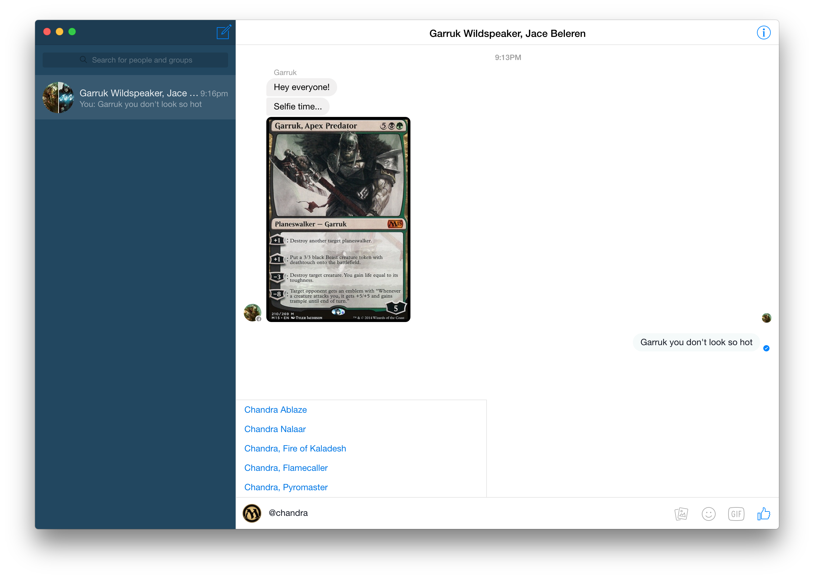
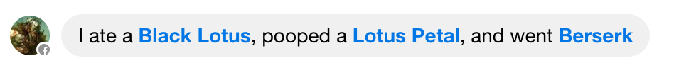

# &nbsp;GGMessenger

> An unofficial Facebook Messenger for Magic & Hearthstone addicts.

<br>
[](https://github.com/sindresorhus/caprine/releases/latest)

Supports both OSX and Windows.  Based on [*Caprine*](https://github.com/sindresorhus/caprine/releases/latest) by Sindre Sorhus.

## Features

### Easy card linking

Link any card from either Hearthstone or Magic with '@cardname' and autocomplete.  Toggle the game by clicking on the MTG / Hearthstone Icon.



### Inline card tooltips

Use a card name with tooltip in any sentence by typing [mtg::cardname] for Magic cards and [hs::cardname] for Hearthstone cards.  For example:

```
I ate a [mtg::black lotus], pooped a [mtg::lotus petal], and went [mtg::berserk].
```



### Easy deck linking via URL

GGMessenger automatically expands decks from URLs that it recognizes.  Currently, it supports:

###### MTG
* [tappedout.net](Tappedout)
* [mtgtop8.com](MTG Top 8)
* [mtggoldfish.com](MTGGoldfish)
* [mtgsalvation.com](MTGSalvation)
* [channelfireball.com](Channel Fireball)

###### Hearthstone
* [hearthpwn.com](HearthPwn)
* [hearthhead.com](HearthHead)

## Dev

Built with [Electron](http://electron.atom.io).

###### Commands

- Init: `$ npm install`
- Run: `$ npm start`
- Build OS X: `$ npm run build-osx`
- Build Linux: `$ npm run build-linux`
- Build Windows: `$ npm run build-windows`
- Build all: `$ brew install wine` and `$ npm run build` *(OS X only)*

## License

MIT © [Jay Ni](https://github.com/jayxni)
