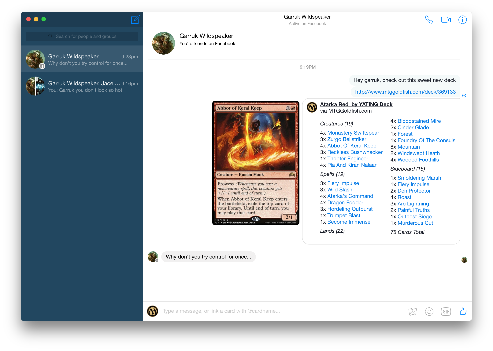

# &nbsp;GGMessenger

> An unofficial Facebook Messenger for Magic & Hearthstone addicts.

Supports both OSX and Windows.  Based on [*Caprine*](https://github.com/sindresorhus/caprine/releases/latest) by Sindre Sorhus.

NOTE: Your computer must have access to MTG / Hearthstone sites to support integrations.  Firewalls will prevent integrations from working.

* [OSX 10.9+ Zip](https://www.dropbox.com/s/o0r8pty6shubwqb/GGMessenger-osx-0.4.0.zip?dl=0)
* [Windows 7+ Installer](https://www.dropbox.com/s/d8kwqkukferm0xj/GGMessenger-v0.4.0.exe?dl=0)

<br>
[](https://github.com/sindresorhus/caprine/releases/latest)

## Features

### Easy card linking

Link any card from either Hearthstone or Magic with '@cardname' and autocomplete.  Toggle the autocomplete game by clicking on the MTG / Hearthstone Icon.

### Inline card tooltips

Use a card name with tooltip in any sentence by typing [mtg::cardname] for Magic cards and [hs::cardname] for Hearthstone cards.  For example:

```
I ate a [mtg::black lotus], pooped a [mtg::lotus petal], and went [mtg::berserk].
```


### Easy deck linking via URL

GGMessenger automatically expands decks from URLs that it recognizes.  Currently, it supports:

###### MTG
* [TappedOut.net](http://tappedout.net)
* [MTGTop8](http://mtgtop8.com)
* [MTGGoldfish](http://mtggoldfish.com)
* [MTGSalvation](http://mtgsalvation.com)
* [Channel Fireball](http://channelfireball.com)

###### Hearthstone
* [HearthPwn](http://hearthpwn.com)
* [HearthHead](http://hearthhead.com)

### Work in progress

Other features in the works (but not quite done yet...)

* Linking / importing deck from Hearthstone or MTGO client (PC only)
* TCGPlayer pricing next to card names.
* Support for more amazing games.  If you have any suggestions, let me know!

## Screenshots


## Dev

Built with [Electron](http://electron.atom.io).

###### Commands

- Init: `$ npm install`
- Run: `$ npm start`
- Build OS X: `$ npm run build-osx`
- Build Linux: `$ npm run build-linux`
- Build Windows: `$ npm run build-windows`
- Build all: `$ brew install wine` and `$ npm run build` *(OS X only)*

## License

MIT © [Jay Ni](https://github.com/jayxni)
